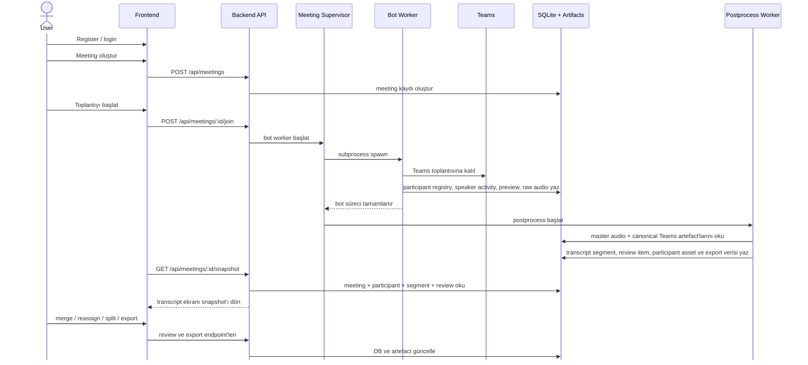

# Notera

Notera, Microsoft Teams toplantılarına bot ile katılıp toplantı verisini toplayan; toplantı bittiğinde audio-first postprocess çalıştırıp transcript, konuşmacı eşleşmesi ve review akışını tek ekranda sunan bir uygulamadır.

Bugünkü yapı dört ana parçadan oluşur:

- `frontend/`: React + TypeScript + Vite arayüzü
- `backend/`: FastAPI API, auth, snapshot, review ve export katmanı
- `backend/workers/`: Teams botu ve postprocess worker’ları
- `data/`: SQLite veritabanı ve üretilen meeting artefact’ları

## Sistem Akışı



Özet akış:

1. Dashboard üzerinden bir Teams linki ile meeting kaydı açılır.
2. `MeetingSupervisor`, bot worker’ı subprocess olarak başlatır.
3. Bot Teams toplantısına katılır ve runtime verisini `data/` altına yazar.
4. Bot bittiğinde supervisor postprocess worker’ı tetikler.
5. Postprocess master audio üzerinden segment üretir, konuşmacı ataması yapar ve review verisi oluşturur.
6. Transcript ekranı snapshot endpoint’i üzerinden son durumu okur.

## Ürün Özeti

- Email tabanlı register / login
- Dashboard’dan Teams linki ile meeting oluşturma
- Bot ile toplantıya katılma ve toplantıyı durdurma
- Canlı preview görüntüsü alma
- Master audio capture ve meeting artefact üretimi
- Participant registry ve konuşmacı eşleme
- Transcript ekranında:
  - audio player
  - participant registry
  - merge / split / reassign review akışı
  - TXT ve CSV export

## Repo Haritası

### Backend

- `backend/main.py`
  FastAPI uygulaması, middleware, route registration, startup bootstrap
- `backend/__main__.py`
  Uvicorn giriş noktası
- `backend/api/routes/`
  `auth`, `meetings`, `reviews`, `media`, `exports`
- `backend/orchestration/supervisor.py`
  Bot ve postprocess worker subprocess yaşam döngüsü
- `backend/workers/bot.py`
  Teams katılımı, preview, roster, speaker activity ve audio capture
- `backend/workers/postprocess_worker.py`
  Audio materialization, transcription, speaker assignment ve review üretimi
- `backend/services/`
  Meeting, auth, export, review ve transcript snapshot mantığı
- `backend/runtime/`
  Path, bootstrap, logging, sabitler ve runtime yardımcıları

### Frontend

- `frontend/src/features/auth/`
  Login / register ekranı
- `frontend/src/features/dashboard/`
  Meeting oluşturma, başlatma, durdurma ve silme akışı
- `frontend/src/features/transcripts/`
  Snapshot polling, transcript ekranı, participant registry ve review araçları
- `frontend/src/components/`
  Status pill, metric card, app shell, audio player
- `frontend/src/styles/`
  Token, base, component ve page seviyesinde stil katmanı

### Test ve Araçlar

- `tests/test_participant_keys.py`
  Participant identity / key stabilitesi
- `tests/test_participant_names.py`
  Participant isim normalizasyonu
- `tests/test_postprocess_audio_windows.py`
  Audio window mantığı
- `tests/test_meeting_audio_chunk_writer.py`
  Audio finalize / chunk writer davranışı
- `backend/tools/meeting_regression.py`
  Kayıtlı meeting’ler için replay / summary aracı

## Veri ve Artefact Yapısı

Varsayılan veri kökü `data/` klasörüdür.

```text
data/
  notera.db
  live_previews/
  meeting_audio/
    meeting_<id>/
      master.webm
      master_16k_mono.wav
      teams_canonical.json
      whisperx_result.json
      alignment_map.json
      chunks/
      sources/
      participants/
  review_clips/
  runtime_cache/
```

Önemli noktalar:

- `notera.db`
  Uygulamanın ana SQLite veritabanı
- `meeting_audio/meeting_<id>/`
  Her meeting için ham ve işlenmiş audio artefact’ları
- `teams_canonical.json`
  Bot tarafının normalize ettiği Teams / participant / speaker activity özeti
- `whisperx_result.json`
  Postprocess sonucunda üretilen transcript ve eşleme özeti
- `live_previews/`
  Kullanıcı bazlı son preview görseli
- `review_clips/`
  Review ekranında kullanılan kısa audio clip’ler

## Gereksinimler

- Conda
- Python 3.11
- Node.js 22
- ffmpeg
- Playwright Chromium

Python bağımlılıkları `backend/requirements.txt`, Node bağımlılıkları `frontend/package.json` içinde tutulur. Conda ortamı `environment.yml` ile kurulabilir.

## Kurulum

### 1. Conda ortamını oluştur

```bash
conda env create -f environment.yml
conda activate teams-bot
```

Mevcut ortamı güncellemek istersen:

```bash
conda env update -n teams-bot -f environment.yml --prune
conda activate teams-bot
```

### 2. Playwright Chromium yükle

```bash
conda run -n teams-bot python -m playwright install chromium
```

### 3. Frontend bağımlılıklarını kur

```bash
cd frontend
conda run -n teams-bot npm install
cd ..
```

### 4. Gerekirse `.env` oluştur

```bash
cp .env.example .env
```

Lokal geliştirmede çoğu durumda `.env` zorunlu değildir. Varsayılan path’ler repo altındaki `data/` klasörünü kullanır.

## Ortam Değişkenleri

Backend `NOTERA_` prefix’i ile çalışır.

### Sık kullanılan backend değişkenleri

- `NOTERA_API_HOST`
- `NOTERA_API_PORT`
- `NOTERA_LOG_LEVEL`
- `NOTERA_LOG_FORMAT`
- `NOTERA_SESSION_SECRET`
- `NOTERA_DB_PATH`
- `NOTERA_MEETING_AUDIO_ROOT`
- `NOTERA_LIVE_PREVIEW_ROOT`
- `NOTERA_REVIEW_CLIP_ROOT`
- `NOTERA_RUNTIME_CACHE_ROOT`
- `NOTERA_BOT_PYTHON_BIN`

### Frontend değişkenleri

- `VITE_API_BASE_URL`
- `VITE_LOG_LEVEL`

Not:

- Vite dev server `/api` ve `/health` isteklerini otomatik olarak `http://127.0.0.1:8000` backend’ine proxy eder.
- Bu yüzden lokal geliştirmede çoğu zaman `VITE_API_BASE_URL` tanımlamak gerekmez.

## Lokal Geliştirme

### Backend

```bash
conda run -n teams-bot python -m backend
```

Backend varsayılan olarak:

- `0.0.0.0:8000` üstünde açılır
- startup sırasında SQLite schema bootstrap çalıştırır
- supervisor reconciliation yapar
- hot reload açmaz

### Frontend

```bash
cd frontend
conda run -n teams-bot npm run dev
```

Varsayılan adresler:

- Frontend dev: `http://localhost:5173`
- Frontend preview: `http://localhost:4173`
- Backend health: `http://localhost:8000/health`

## Kullanıcı Akışı

### 1. Giriş

- İlk kullanımda `Register`
- Sonraki kullanımlarda `Login`
- Session cookie backend tarafından yazılır

### 2. Meeting oluştur

Dashboard’da:

- toplantı adı gir
- gerçek Teams join linki gir
- istersen audio capture toggle’ını açık bırak

Backend `POST /api/meetings` ile meeting kaydı oluşturur.

### 3. Meeting’i başlat

Dashboard’daki `join` aksiyonu:

- `POST /api/meetings/{id}/join`
- supervisor bot worker başlatır
- meeting durumu `joining` / `active` olur

### 4. Toplantı sırasında

Bot şunları üretir:

- participant registry
- speaker activity
- live preview
- raw / master audio artefact’ları

### 5. Toplantı bittikten sonra

Supervisor postprocess worker başlatır.

Postprocess:

- audio’yu materialize eder
- transcription çalıştırır
- participant asset üretir
- segmentleri konuşmacılarla eşlemeye çalışır
- review ve export verisini hazırlar

### 6. Transcript ekranı

Transcript sayfası `GET /api/meetings/{id}/snapshot` ile tüm durumu tek payload olarak çeker.

Bu ekran üzerinden:

- master audio dinlenir
- participant registry kontrol edilir
- duplicate participant merge yapılır
- segment speaker ataması güncellenir
- segment split yapılır
- TXT / CSV export alınır

## Temel API Yüzeyi

### Auth

- `POST /api/auth/register`
- `POST /api/auth/login`
- `POST /api/auth/logout`
- `GET /api/auth/me`

### Meetings

- `GET /api/meetings`
- `POST /api/meetings`
- `GET /api/meetings/{meeting_id}`
- `POST /api/meetings/{meeting_id}/join`
- `POST /api/meetings/{meeting_id}/stop`
- `DELETE /api/meetings/{meeting_id}`
- `GET /api/meetings/{meeting_id}/snapshot`

### Reviews

- `PATCH /api/transcript-segments/{segment_id}/participant`
- `POST /api/meetings/{meeting_id}/participants/merge`
- `POST /api/meetings/{meeting_id}/participants/split`

### Media

- `GET /api/media/meetings/{meeting_id}/audio`
- `GET /api/media/meetings/{meeting_id}/preview`
- `GET /api/media/meetings/{meeting_id}/participants/{participant_id}/audio`
- `GET /api/media/reviews/{review_id}/clip`

### Export

- `GET /api/meetings/{meeting_id}/export.txt`
- `GET /api/meetings/{meeting_id}/export.csv`

## Doğrulama Komutları

### Frontend type-check

```bash
cd frontend
./node_modules/.bin/tsc -b
```

### Frontend production build

```bash
cd frontend
conda run -n teams-bot npm run build
```

### Backend syntax kontrolü

```bash
conda run -n teams-bot python -m compileall backend
```

### Testler

```bash
conda run -n teams-bot python -m unittest discover -s tests -p 'test_*.py'
```

### Recorded meeting regression aracı

Sadece summary görmek için:

```bash
conda run -n teams-bot python -m backend.tools.meeting_regression 1 2
```

Postprocess’i yeniden koşturup özet almak için:

```bash
conda run -n teams-bot python -m backend.tools.meeting_regression --rerun 1 2
```

## Production

Production compose dosyası:

- `docker-compose.prod.yml`

Çalıştırma:

```bash
docker compose -f docker-compose.prod.yml up --build -d
```

Production container yapısı:

- backend image:
  - `backend/Dockerfile`
  - Python 3.11 slim
  - ffmpeg
  - Playwright Chromium
  - veri kökü `/data`
- frontend image:
  - `frontend/Dockerfile`
  - Vite build + nginx

Varsayılan production davranışı:

- frontend host üzerinde `3000` portundan yayınlanır
- backend container içinde `8000` portunda çalışır
- kalıcı veri `notera-data` volume’unda tutulur

Production notları:

- `NOTERA_SESSION_SECRET` mutlaka değiştirilmeli
- backend data path’leri volume üstünde kalıcı tutulmalı
- production compose dosyasında backend port mapping yok; frontend nginx backend’e container network üzerinden erişir

## Geliştirme Notları

- Backend startup sırasında schema bootstrap yapar; ayrı migration aracı yoktur.
- Supervisor, yarım kalmış worker run’ları startup’ta reconcile eder.
- Meeting artefact’ları ve DB kayıtları birlikte düşünülmelidir; sadece DB temizliği yeterli değildir.
- Completed bir meeting’i yeniden başlatmak yerine yeni meeting kaydı açmak daha doğru akıştır.
