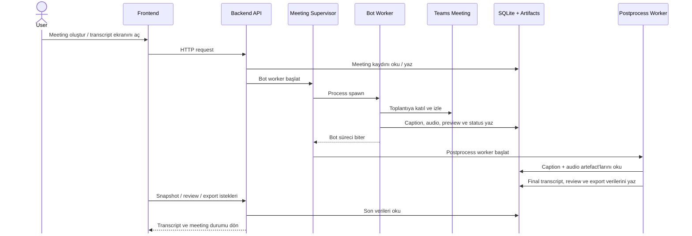

# Notera

Notera, Microsoft Teams toplantılarına bot ile katılıp canlı caption, ses kaydı ve önizleme toplayan; toplantı sonrasında transcript'i işleyip review akışıyla düzenlemeyi sağlayan bir uygulamadır.

## Mimari



Kısa akış:

1. Frontend kullanıcı aksiyonlarını Backend API'ye gönderir.
2. Backend meeting kaydını açar ve `MeetingSupervisor` üzerinden bot worker başlatır.
3. Bot worker Teams toplantısına katılır; canlı caption, ses ve önizleme üretip runtime verisine yazar.
4. Bot tamamlanınca supervisor postprocess worker başlatır.
5. Postprocess worker toplanan veriyi işleyip final transcript ve review kayıtlarını üretir.
6. Frontend dashboard ve transcript ekranları bu son durumu API üzerinden okur.

## Özellikler

- Teams toplantı linki ile yeni toplantı başlatma
- Toplantı sırasında canlı caption, ses kaydı ve ekran önizlemesi toplama
- Toplantı sonrasında transcript işleme
- Transcript ekranında review akışı
- `TXT` ve `CSV` export

## Klasörler

- `frontend/`
  React + TypeScript + Vite arayüzü
- `backend/`
  FastAPI API, auth, meeting lifecycle, review ve export mantığı
- `backend/workers/`
  Teams botu ve transcript işleme worker'ları
- `data/`
  SQLite veritabanı ve üretilen artefact'lar

## Gereksinimler

- Conda
- Python 3.11
- Node.js 22
- ffmpeg
- Playwright Chromium

`environment.yml` Python, Node ve backend bağımlılıklarını hazırlar.

## Kurulum

### 1. Conda ortamını kur

Yeni kurulum:

```bash
conda env create -f environment.yml
conda activate teams-bot
```

Mevcut ortamı güncellemek istersen:

```bash
conda env update -n teams-bot -f environment.yml --prune
conda activate teams-bot
```

### 2. Playwright browser yükle

```bash
conda run -n teams-bot python -m playwright install chromium
```

### 3. Frontend paketlerini yükle

```bash
cd frontend
conda run -n teams-bot npm install
cd ..
```

### 4. Gerekirse `.env` oluştur

```bash
cp .env.example .env
```

Varsayılan ayarlar çoğu lokal kullanım için yeterlidir. Özelleştirme gerekiyorsa `.env.example` dosyasını temel al.

## Ortam Değişkenleri

Backend için sık kullanılan değişkenler:

- `NOTERA_API_HOST`
- `NOTERA_API_PORT`
- `NOTERA_SESSION_SECRET`
- `NOTERA_DB_PATH`
- `NOTERA_MEETING_AUDIO_ROOT`
- `NOTERA_LIVE_PREVIEW_ROOT`
- `NOTERA_REVIEW_CLIP_ROOT`
- `NOTERA_RUNTIME_CACHE_ROOT`
- `NOTERA_BOT_PYTHON_BIN`

Frontend için opsiyonel değişken:

- `VITE_API_BASE_URL`

Geliştirme modunda Vite `/api` ve `/health` isteklerini otomatik olarak backend'e proxy eder. Bu yüzden çoğu lokal kullanımda `VITE_API_BASE_URL` tanımlamak gerekmez.

## Lokal Çalıştırma

Backend:

```bash
conda run -n teams-bot python -m backend
```

Frontend:

```bash
cd frontend
conda run -n teams-bot npm run dev
```

Adresler:

- Frontend: `http://localhost:5173`
- Backend health: `http://localhost:8000/health`

## Kullanım Akışı

1. Kullanıcı giriş yapar.
2. Dashboard üzerinden toplantı adı ve Teams toplantı linki girer.
3. Backend toplantı kaydını oluşturur ve bot sürecini başlatır.
4. Bot toplantıya katılır, caption, ses ve önizleme üretir.
5. Toplantı tamamlandıktan sonra transcript işleme aşaması çalışır.
6. Transcript ekranında review önerileri, önizleme ve export aksiyonları görünür.

## Doğrulama

Frontend type-check:

```bash
cd frontend
./node_modules/.bin/tsc -b
```

Frontend production build:

```bash
cd frontend
conda run -n teams-bot npm run build
```

Backend syntax doğrulaması:

```bash
conda run -n teams-bot python -m compileall backend
```

Şu an repoda ayrı bir lint veya otomatik test komutu tanımlı değil. Günlük doğrulama akışı build ve syntax kontrolleri üzerinden ilerliyor.

## Production

Production compose dosyası:

- `docker-compose.prod.yml`

Çalıştırma:

```bash
docker compose -f docker-compose.prod.yml up --build -d
```

Varsayılan davranış:

- frontend host üzerinde `3000` portunda açılır
- backend container içinde `8000` portunda çalışır
- kalıcı veri `notera-data` volume'unda tutulur
